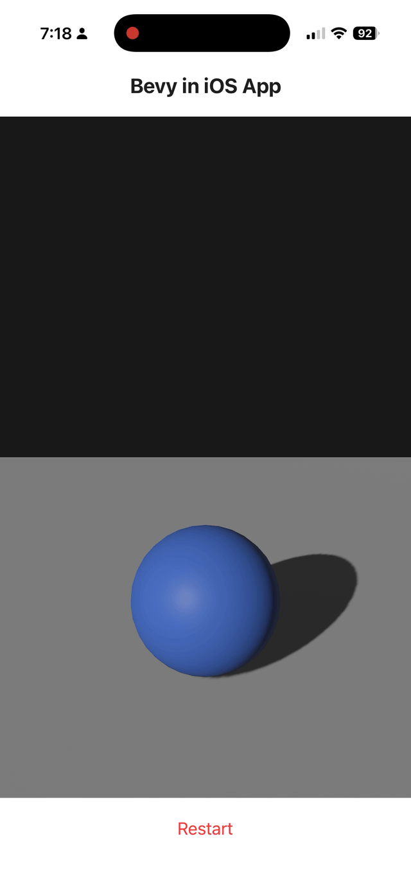
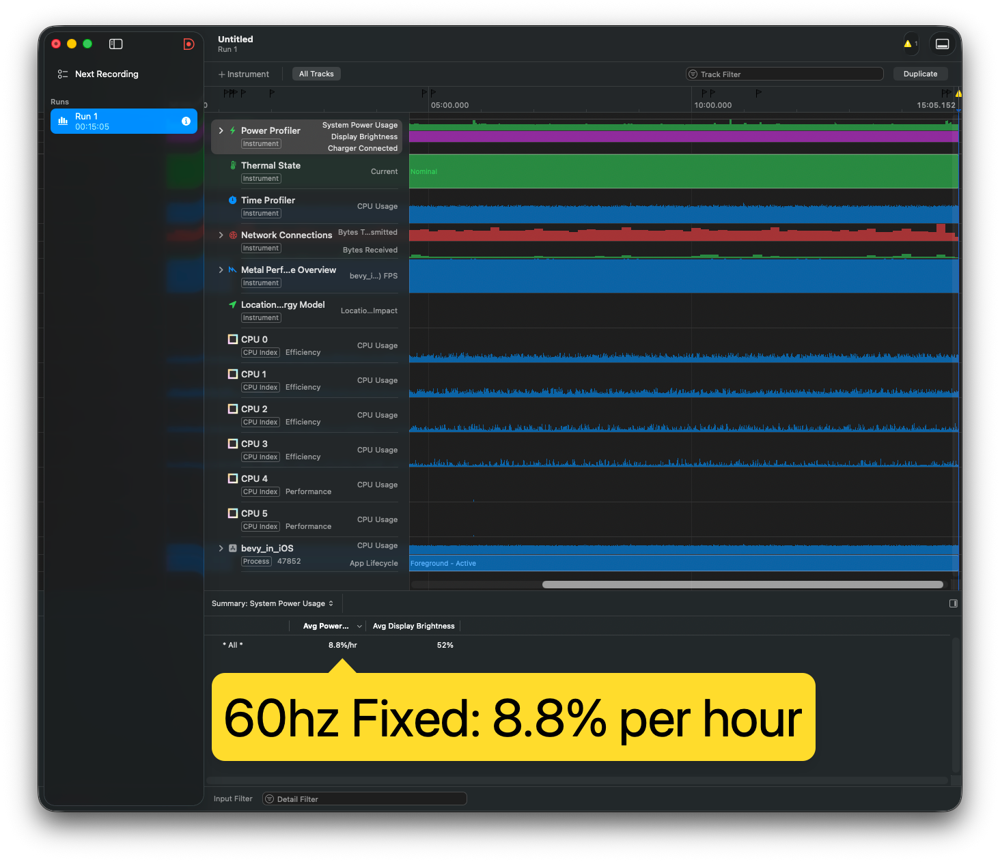
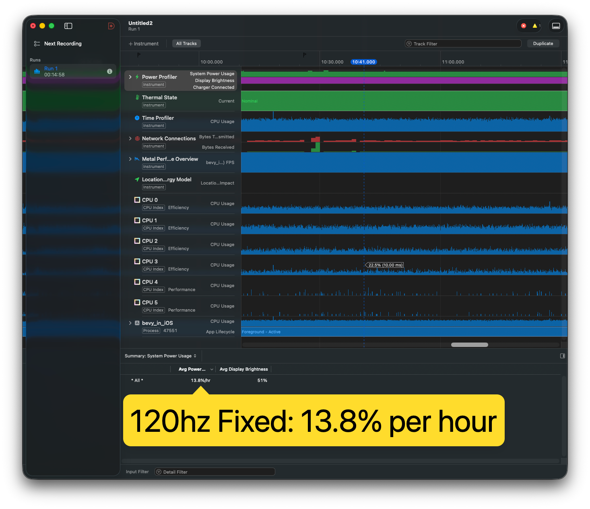

# Bevy in App

> **Note:** This is a fork of the original [bevy-in-app](https://github.com/bevyengine/bevy-in-app) repository with modifications for a simplified bouncing ball demo and performance optimizations.

Integrate the [Bevy engine](https://github.com/bevyengine/bevy) into existing iOS | Android apps.

If you want to add a mini-game to an existing app, or implement some dynamic UI components, charts ..., or just want to take advantage of the **Motion Sensors** on your phone for some cool gameplay, you can't use `WinitPlugin`. Because `winit` will take over the entire app initialization process and windowing, but we need to create `bevy::App` in an existing app instance, and we may also want `bevy::App` to run in an `iOS UIView` or `Android SurfaceView` of any size.

This fork implements a simple 3D bouncing sphere demo optimized for mobile devices.

## Changes from Original

This fork includes the following modifications:

- **120Hz / ProMotion Support**: Added support for requesting 120Hz refresh rates on iOS devices with ProMotion displays
- **Simplified Demo**: Replaced the breakout game with a basic 3D sphere bounce animation
- **Removed Accelerometer Code**: Removed all CoreMotion/accelerometer boilerplate code that was used for the original breakout game
- **Locked Dependency Versions**: Pinned dependency versions in `Cargo.toml` for reproducible builds
- **Optimized Bevy Features**: Slimmed down Bevy feature flags for better battery life by removing:
  - `multi_thread` (single-threaded execution)
  - `bevy_text` (text rendering disabled)

## Screenshots

|  |
| ------------------------------------------------------------------- |


## IOS Power Profiles 




## Build iOS
```sh
# Add iOS target
rustup target add aarch64-apple-ios

# Build for iOS target
sh ./ios_build.sh --release

# Open the xCode project
open ./iOS/bevy_in_iOS.xcodeproj
```

## **Android**

### Set up Android environment

Assuming your computer already has Android Studio installed, go to `Android Studio` > `Tools` > `SDK Manager` > `Android SDK` > `SDK Tools`. Check the following options for installation and click OK.

- [x] Android SDK Build-Tools
- [x] Android SDK Command-line Tools
- [x] NDK(Side by side)

Then, set two following environment variables:

```sh
export ANDROID_SDK_ROOT=$HOME/Library/Android/sdk
# Replace the NDK version number with the version you installed
export NDK_HOME=$ANDROID_SDK_ROOT/ndk/23.1.7779620
```

### Add build targets

```sh
# Since simulator and virtual devices only support GLES,
# `x86_64-linux-android` and `i686-linux-android` targets are not necessary
rustup target add aarch64-linux-android
```

### Build

```sh
# Install cargo-so subcommand
cargo install cargo-so

# Build
sh ./android_build.sh --release
```

## Compatible Bevy versions

| Bevy version  | `bevy-in-app` version |
| :------------ | :-------------------- |
| `0.17`        | `0.5`                 |
| `0.16`        | `0.4`                 |
| `0.14 dev`    | `0.3`                 |
| `0.11`-`0.12` | `0.2`                 |
| `0.10`        | `0.1`                 |
